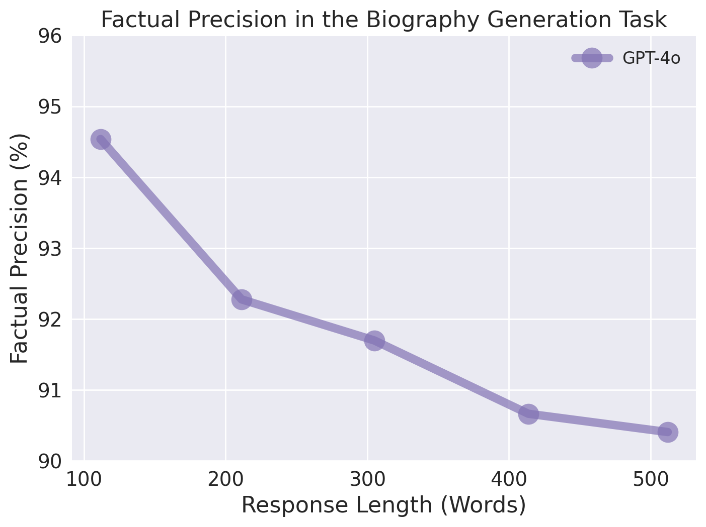

# How Does Response Length Affect Long-Form Factuality?
This repository contains the code and data for our ACL 2025 Findings paper "How Does Response Length Affect Long-Form Factuality".

<p align="left">
  
</p>

## 📁 Repository Structure
```plaintext
.
├── data
│   ├── dataset
│   │   ├── biography_generation.jsonl
│   │   ├── long_fact_description.jsonl
│   ├── human_annotations 
├── scripts # code for empirical analysis
│   ├── error_propagation 
│   ├── length_bias.py
│   ├── long_context.py
│   ├── facts_exhaustion.py
├── README.md
```
🚧 We are still working on the code and data. Please check back soon for updates. The implementation of **BAFE** will be released shortly.


## 🚀 Getting Started

```bash
pip install openai
```
You need to prepare an OpenAI API key to run the code.

## 📈 Empirical Experiments

### Length Bias 
```bash
python scripts/length_bias.py --input_path ../data/dataset/biography_generation.jsonl \
--length 100 --api_key YOUR_API_KEY
```
- You can change the `--length` parameter to specify the response length. The default value is 100.

- You can chenge the `--input_path` to `../data/dataset/long_fact_description.jsonl` to run the expriment on another dataset.

### Error Propagation

1. **Autocorrelation Analysis**
```bash
python scripts/autocorrelation_response_gen.py --api_key YOUR_API_KEY
```
We will provide a step-by-step guide for autocorrelation analysis soon.

2. **Counterfactual Analysis**
  
- First, split the first sentence from the response using `split_first_sentence.py` script
- Then, run the analysis with the prompt template provided in `prompt_counterfactual_analysis.py`.

### Long Context
```bash
python scripts/long_context.py --topic1 "personal life" --topic2 "career" \
--context_length 200 --evaluation_length 200 --api_key YOUR_API_KEY
```
- `topic1` and `context_length` are the settings for the context section.
- `topic2` and `evaluation_length` are the settings for the evaluation section.
- `topic1` and `topic2` can be set to "personal life", "early life" or "career".

### Facts Exhaustion
**Single-Topic Setting**
```bash
python scripts/facts_exhaustion.py --setting "single" --topic1 "career" \
--topic1_length 400 --api_key YOUR_API_KEY
```
**Multiple-Topic Setting**
```bash
python scripts/facts_exhaustion.py --setting "multiple" --topic1 "early life" --topic2 "career" \
--topic1_length 200 --topic2_length 200 --api_key YOUR_API_KEY
```
- `topic1` and `topic2` can be set to "personal life", "early life" or "career".

## 📪 Contact
For questions or suggestions, please feel free to contact xu.zhao@u.nus.edu
