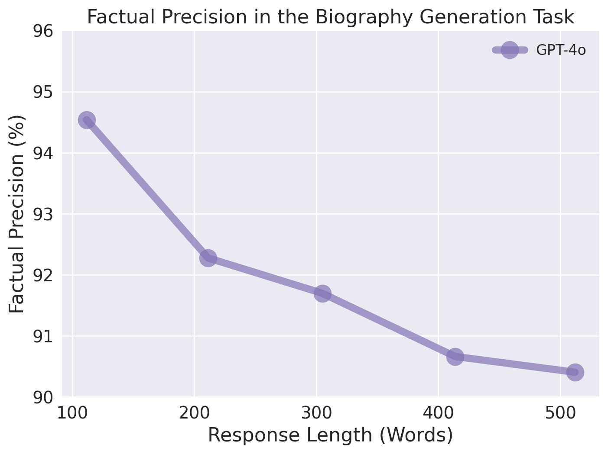

# How Does Response Length Affect Long-Form Factuality?
This repository contains the code and data for our ACL 2025 Findings paper ["How Does Response Length Affect Long-Form Factuality".](https://aclanthology.org/2025.findings-acl.161.pdf)

<p align="left">
  
</p>

## 📁 Repository Structure
```plaintext
.
├── data
│   ├── dataset
│   │   ├── biography_generation.jsonl
│   │   ├── long_fact_description.jsonl
│   ├── human_annotations 
├── FActScore # repo for FActScore
├── scripts # code for empirical analysis
│   ├── error_propagation 
│   ├── length_bias.py
│   ├── long_context.py
│   ├── facts_exhaustion.py
├── verify_unsupported_w_google.py
├── get_final_decisions.py
├── query_serper.py
├── prompt.py
├── search_config.py
├── tool.py
├── requirements.txt
├── README.md
```

## 🚀 Getting Started

**For BAFE:**

We suggest to follow the setup instruction in `FActScore/`.
Python 3.9 is recommended for FActScore compatibility.

```bash
pip install -r requirements.txt
```
```bash
export OPENAI_API_KEY="your-openai-api-key"
export SERPER_API_KEY="your-serper-api-key"
```

`SERPER_API_KEY` and `OPENAI_API_KEY` are needed for BAFE verification. 

**For empirical experiments:**
```bash
pip install openai
```
You need to prepare an OpenAI API key to run the code.

## ✅ BAFE verification pipeline

1. Generate model responses.
2. Run FActScore to obtain atomic fact decisions.
3. Verify FActScore-unsupported facts with Google/Serper.
4. Merge FActScore and Google labels into final decisions.

The verifier expects a model-output JSONL file:

```json
{"index": 0, "input": "Tell me a bio of ...", "output": "...", "topic": "...", "cat": ["..."]}
```

It also expects the corresponding FActScore sidecar:

```text
<input_stem>_factscore_output.json
```

For `output/gpt-4o/context_len/run.jsonl`, the default sidecar is
`output/gpt-4o/context_len/run_factscore_output.json`. Use `--factscore_path`
to pass another file.

### Verify Unsupported Facts

```bash
python verify_unsupported_w_google.py \
  --input_path output/gpt-4o/context_len/run.jsonl \
  --output_root output/gpt-4o/context_len \
  --workers 20 \
  --overwrite
```

This runs `find`, `revise`, `query`, `search`, and `rate`. To resume from a
specific stage:

```bash
python verify_unsupported_w_google.py \
  --input_path output/gpt-4o/context_len/run.jsonl \
  --output_root output/gpt-4o/context_len \
  --start_stage query \
  --stop_stage rate \
  --workers 20 \
  --overwrite
```

Outputs are written under `<output_root>/vanilla_unsupported/`,
`<output_root>/revise_self_contained/`, and
`<output_root>/google_verification/`. Defaults are configured in
`search_config.py`.

### Merge Final Decisions

After Google verification, merge the original FActScore labels with the Google
verification labels:

```bash
python get_final_decisions.py \
  --input_path output/gpt-4o/context_len/run.jsonl \
  --google_verified_results output/gpt-4o/context_len/google_verification/run_final_answers1.jsonl \
  --output_path output/gpt-4o/context_len/run_final_decisions.jsonl \
  --overwrite
```

If you already have the revised intermediate file, pass it directly:

```bash
python get_final_decisions.py \
  --factscore_path output/gpt-4o/context_len/revise_self_contained/run_revised.jsonl \
  --google_verified_results output/gpt-4o/context_len/google_verification/run_final_answers1.jsonl \
  --output_path output/gpt-4o/context_len/run_final_decisions.jsonl \
  --overwrite
```

Use `--overwrite` for clean reruns, and reduce `--workers` if you hit API rate
limits.

For detailed options:

```bash
python verify_unsupported_w_google.py --help
python get_final_decisions.py --help
```

## 📈 Empirical Experiments

### Length Bias 
```bash
python scripts/length_bias.py --input_path ../data/dataset/biography_generation.jsonl \
--length 100 --api_key YOUR_API_KEY
```
- You can change the `--length` parameter to specify the response length. The default value is 100.

- You can chenge the `--input_path` to `../data/dataset/long_fact_description.jsonl` to run the expriment on another dataset.

### Error Propagation

1. **Autocorrelation Analysis**
```bash
python scripts/autocorrelation_response_gen.py --api_key YOUR_API_KEY
```

2. **Counterfactual Analysis**
  
- First, split the first sentence from the response using `split_first_sentence.py` script
- Then, run the analysis with the prompt template provided in `prompt_counterfactual_analysis.py`.

### Long Context
```bash
python scripts/long_context.py --topic1 "personal life" --topic2 "career" \
--context_length 200 --evaluation_length 200 --api_key YOUR_API_KEY
```
- `topic1` and `context_length` are the settings for the context section.
- `topic2` and `evaluation_length` are the settings for the evaluation section.
- `topic1` and `topic2` can be set to "personal life", "early life" or "career".

### Facts Exhaustion
**Single-Topic Setting**
```bash
python scripts/facts_exhaustion.py --setting "single" --topic1 "career" \
--topic1_length 400 --api_key YOUR_API_KEY
```
**Multiple-Topic Setting**
```bash
python scripts/facts_exhaustion.py --setting "multiple" --topic1 "early life" --topic2 "career" \
--topic1_length 200 --topic2_length 200 --api_key YOUR_API_KEY
```
- `topic1` and `topic2` can be set to "personal life", "early life" or "career".

## 📪 Contact
For questions or suggestions, please feel free to contact xu.zhao@u.nus.edu

## Citation
If you find our work useful, please cite:

```bibtex
@inproceedings{zhao-etal-2025-response,
    title = "How Does Response Length Affect Long-Form Factuality",
    author = "Zhao, James Xu  and
      Liu, Jimmy Z.j.  and
      Hooi, Bryan  and
      Ng, See-Kiong",
    editor = "Che, Wanxiang  and
      Nabende, Joyce  and
      Shutova, Ekaterina  and
      Pilehvar, Mohammad Taher",
    booktitle = "Findings of the Association for Computational Linguistics: ACL 2025",
    month = jul,
    year = "2025",
    address = "Vienna, Austria",
    publisher = "Association for Computational Linguistics",
    url = "https://aclanthology.org/2025.findings-acl.161/",
    doi = "10.18653/v1/2025.findings-acl.161",
    pages = "3102--3125",
    ISBN = "979-8-89176-256-5"
}
```